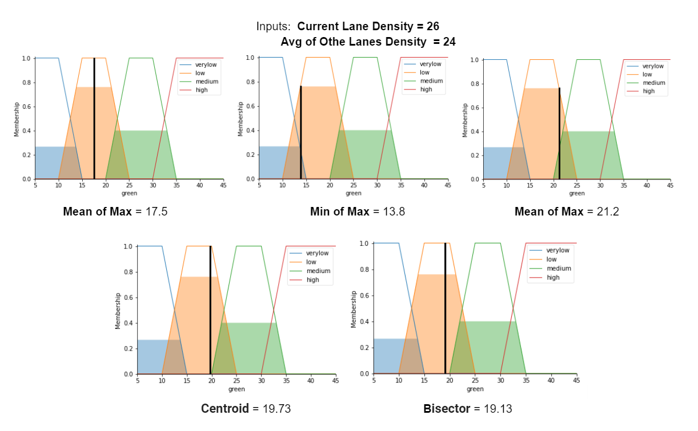

# Street Smart
##### Intelligent Traffic Management System for Smart City

By combining YOLO image processing with fuzzy logic, we attempt to advance a novel technique in the area of traffic management. Using CCTV and YOLO, the suggested system can not only identify common vehicles but also distinguish between them and emergency vehicles, prioritising the latter according to their status. Additionally, it determines the vehicle density across all lanes in that specific intersection. The lane that would get the green signal and how long it would last would be decided using fuzzy logic.

Figure shows how the system is organised. The CCTV camera, which may be seen in the block diagram, will record information about all lanes. Vehicles can be seen in the videos or pictures that make up this data. This information is transmitted to the server that does the picture processing. The server may determine the vehicular density and identify any emergency vehicles using this image processing utilising YOLO. The microcontroller then utilises fuzzy logic to determine which lane should receive the green signal and how long it should last after receiving this data from the server.

Initially, the CCTV camera will record footage of all four lanes of the traffic circle. The values will be read frame by frame in the real-time video of these roadways. All of the input frames that are captured by the camera are sent to the server. A background algorithm filters the video after it is received to determine how many cars are in each lane. The timer is then properly set once each lane is prioritised according to threshold values. Containers or buses will have a higher density than vehicles since vehicle classification and wheel count are taken into account when calculating density for transportation vehicles. Here, the total density of each lane is calculated. Every two seconds, the vehicle density in each lane is calculated.

## Fuzzy Logic

Fuzzy logic technology allows real-life rules to be implemented in a fashion that is comparable to how humans think.

Current lane density and Average of other lanes density were the two input crisp variables taken and were converted to linguistic variables that were high, medium, and low.

The fuzzy output set variables thus obtained were again passed through the trapezoidal membership function which had four green signal duration namely high, medium, low, and very low.

A **rule base** is the set of rules for a fuzzy system. To create a rule, you must specify the antecedents, or IF portions, and consequents, or THEN portions, of the rule.

For defuzzification many functions like mean of maxima, min of maxima, max of maxima, centroid, bisector functions were tried out of which centroid function was selected. 

Comparison between prevailing system and proposed fuzzy system.

